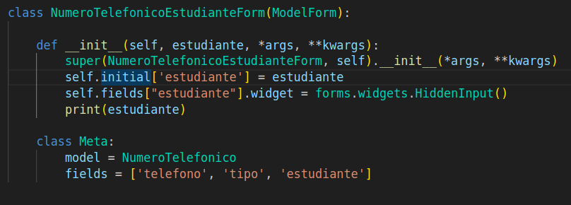

# clase03-2bim

Explicación: 

La parte de _set, nos permite acceder desde la instancia principal (Estudiante) a objetos desde la instancia secundaria o asociada (Numero telefónico).
Esto sucede cuando existe una ForeingKey que relaciona los modelos entre sí.

### 25 de junio de 2025

Tenemos este formulario, que esta basado en el modelo NumeroTelefonico. Permite registrar un numero telefónico para un estudiante, sin la necesidad que se indique a cual pertenece (por la relacion en el modelo).

Lo mas llamativo de esta clase es esta linea:
self.fields["estudiante"].widget = forms.widgets.HiddenInput()

Lo que se hace aqui es ocualtar al modelo estufiante, es decir, lo usamos para asociar la informacion de numero telefónico de manera automatica.

widget:define como se va a mostrar el campo en html.
HiddenInput: no se lo ve de manera visual, pero envia informacion al servidor cuando el formulario se envía.